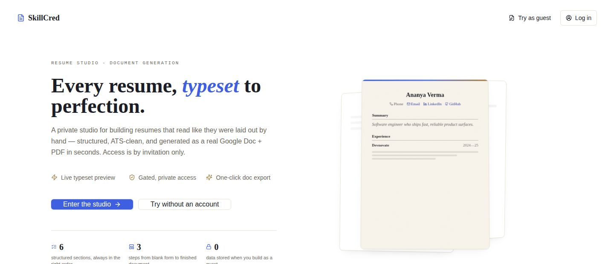
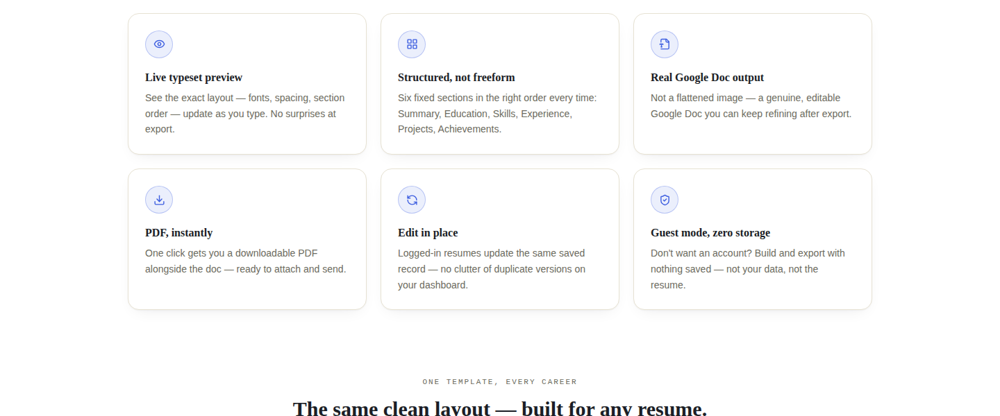
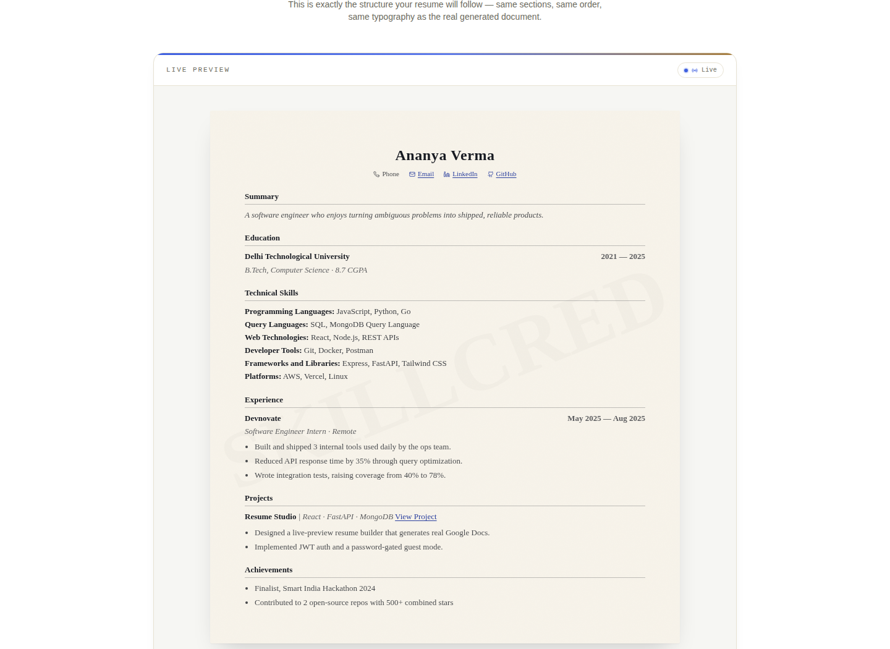
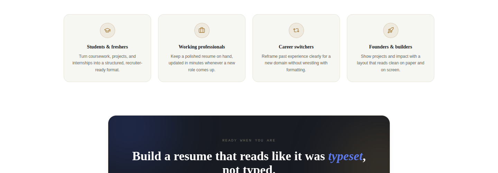

# SkillCred

**Your resume, rebuilt like it means something.**

SkillCred is a full-stack studio that takes you from a blank page to a polished, ATS-safe resume — and now, straight into a shareable personal portfolio site — without ever opening a design tool. Type your story in, and walk out with a document that actually looks like you spent a weekend on it in Figma.

---

## ✦ Every resume, typeset to perfection

A private studio for building resumes that read like they were laid out by hand — structured, ATS-clean, and generated as a real Google Doc + PDF in seconds.



---

## ✦ What SkillCred Actually Does

### 1. Resume Studio
A guided, form-driven resume builder with a real design system behind it — not another Bootstrap template.

- **Structured wizard flow** — contact, summary, education, experience, projects, skills, achievements, captured as clean typed data, not free-text guesswork
- **"Ink & Ledger" design language** — deep navy, ivory, electric cobalt, muted gold, set in Fraunces + Inter + JetBrains Mono. Built to look editorial, not corporate-template
- **Google Apps Script–powered generation pipeline** — your structured data becomes a real, downloadable Google Doc / PDF, no client-side PDF hacks
- **Guest & authenticated flows** — try it gated, no account required; save and revisit resumes once you're signed in
- **Dashboard** — every saved resume, one place, edit anytime



### The live preview — what you type is exactly what you export
No surprises at export time. The typeset preview on-screen is pixel-for-pixel the same structure, spacing, and hierarchy as the generated document.



### 2. Portfolio Generator *(backend live, frontend in progress)*
Turn that same story into a standalone, self-contained portfolio website — one HTML file, zero dependencies, download and host anywhere.

- **Paste-and-go** — drop in raw resume text (or someone else's), Gemini parses it into structured portfolio data
- **One-click from saved resumes** — already built a resume in the Studio? Skip the AI entirely; your saved data maps straight into a portfolio site, deterministically, instantly
- **Self-contained output** — CSS and JS inlined into a single `.html` file. No build step, no hosting config, just double-click and it works

---

## ✦ Built for anyone who needs a resume, fast



---

## ✦ Tech Stack

| Layer | Stack |
|---|---|
| **Frontend** | React 18 + TypeScript, Vite, Tailwind CSS, Framer Motion, Zustand, React Hook Form + Zod, React Router |
| **Backend** | FastAPI (async), Motor (async MongoDB), PyJWT, Passlib/bcrypt |
| **AI** | Google Gemini (`google-genai`) — resume-to-portfolio parsing |
| **Document generation** | Google Apps Script — structured data → Google Doc / PDF |
| **Database** | MongoDB |

---

## ✦ Architecture

```
┌──────────────────────┐      REST / JWT       ┌───────────────────────┐
│   React + TypeScript │ ─────────────────────▶ │       FastAPI          │
│   (client/)          │ ◀───────────────────── │       (server/)        │
└──────────────────────┘                         └───────────┬───────────┘
                                                              │
                                    ┌─────────────────────────┼─────────────────────────┐
                                    ▼                          ▼                          ▼
                          ┌─────────────────┐       ┌──────────────────┐       ┌──────────────────┐
                          │  MongoDB          │       │  Google Apps       │       │  Gemini API        │
                          │  (users, resumes) │       │  Script            │       │  (portfolio parse) │
                          └─────────────────┘       │  → Doc / PDF        │       └──────────────────┘
                                                       └──────────────────┘
```

---

## ✦ Project Structure

```
skillcred/
├── client/                      # React + TypeScript frontend
│   └── src/
│       ├── pages/                # Landing, guest wizard, dashboard
│       ├── components/           # Dashboard shell, resume sections, landing sections
│       └── ...
│
├── server/                      # FastAPI backend
│   └── src/
│       ├── api/v1/
│       │   ├── auth.py           # Signup / login
│       │   ├── users.py
│       │   └── studio/
│       │       ├── gate.py       # Guest access token
│       │       ├── generate.py   # Resume generation (Apps Script)
│       │       ├── resumes.py    # Saved resume CRUD
│       │       └── portfolio.py  # Portfolio generator (Gemini + direct-map)
│       ├── integrations/
│       │   ├── apps_script.py    # Google Apps Script client
│       │   └── gemini.py         # Gemini client — resume text → portfolio JSON
│       ├── models/               # Raw Motor collections (users, saved_resumes)
│       ├── schemas/              # Pydantic contracts
│       ├── utils/
│       │   ├── portfolio_mapping.py   # Saved resume → portfolio JSON, no AI needed
│       │   └── portfolio_render.py    # Builds the self-contained portfolio HTML
│       └── templates/
│           └── portfolio_template.html
│   └── static/portfolio/         # style.css / script.js inlined into every generated portfolio
│
└── portfolio/                    # Original standalone Flask prototype (superseded by server/portfolio.py)
```

---

## ✦ API at a Glance

| Endpoint | Auth | Does |
|---|---|---|
| `POST /api/v1/auth/signup` `/login` | — | Account creation & login |
| `POST /api/v1/studio/gate` | — | Issues a guest studio-access token |
| `POST /api/v1/studio/generate` | Gate token | Resume data → Google Doc/PDF |
| `GET/POST/PUT/DELETE /api/v1/studio/resumes` | JWT | Saved resume CRUD |
| `POST /api/v1/studio/portfolio/generate-from-text` | Gate token | Raw resume text → portfolio site (Gemini) |
| `POST /api/v1/studio/portfolio/generate-from-resume/{id}` | JWT | Saved resume → portfolio site (no AI) |

---

*Built with way too many late nights, one very opinionated design system, and a refusal to ship anything that looks like a Bootstrap template.*
